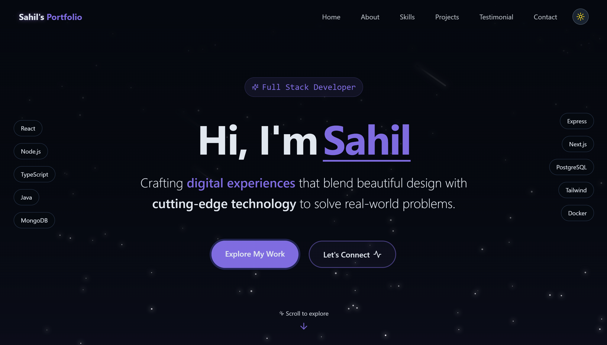
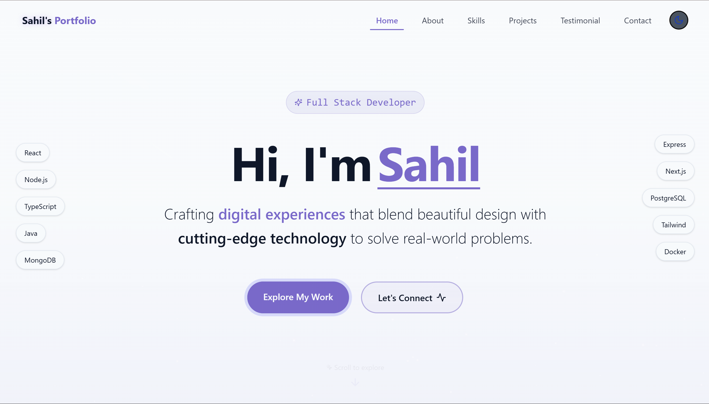
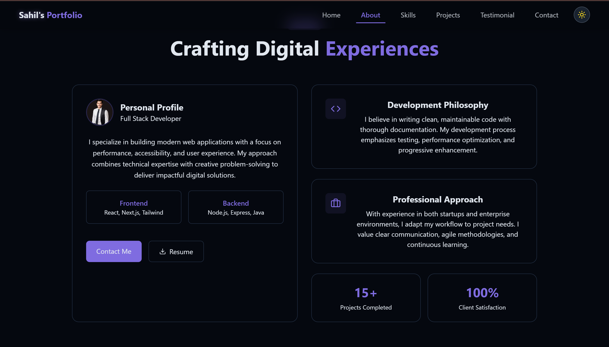
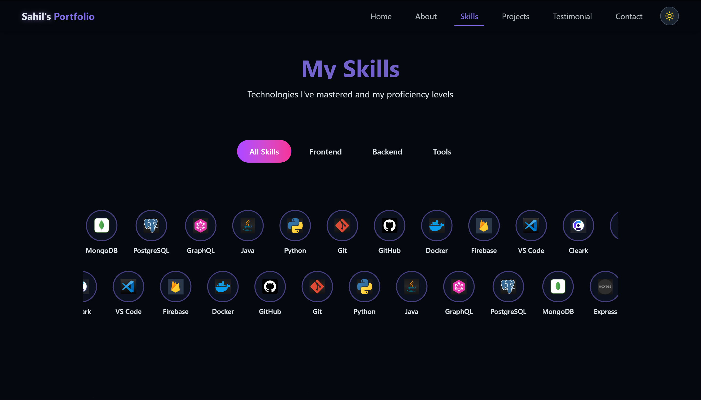
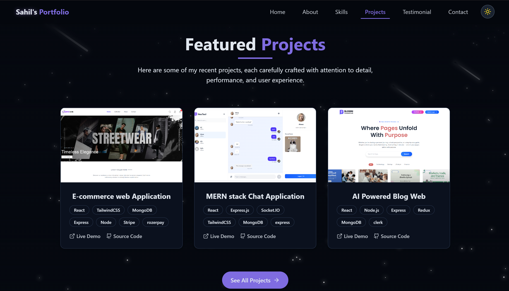
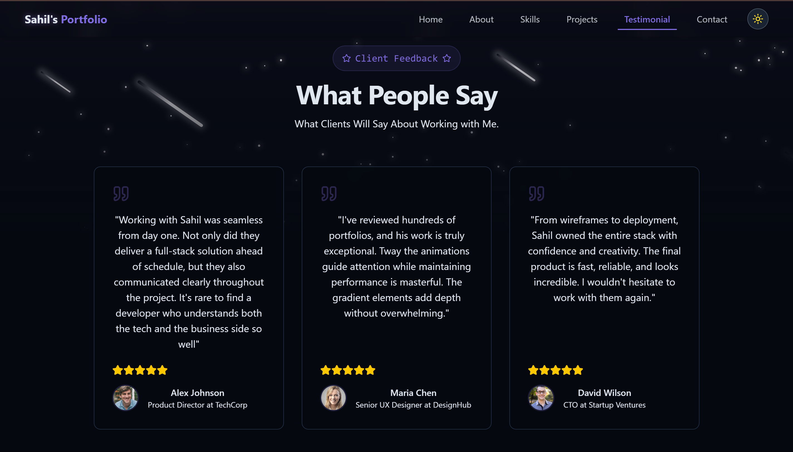
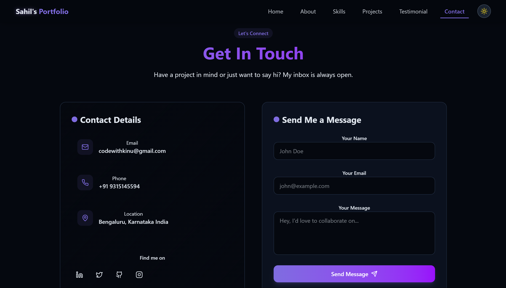

# Developer Portfolio Website

A modern portfolio web application that showcases projects, skills, testimonials, and contact information with smooth animations and responsive design.

Live Application: https://sahil.devlyhub.in/

## Portfolio Preview

### Home / Hero Section



### Other Sections






## Architecture

- Frontend: React with Vite and responsive UI
- Styling: Tailwind CSS with custom theme variables
- Animations: Framer Motion
- Routing: React Router (SPA)
- Contact Handling: Formspree integration
- Hosting: Vercel-ready configuration with SPA rewrites

## Quick Start

### Prerequisites

- Node.js 18+
- npm

### Local Development

```bash
# Clone repository
git clone <your-repository-url>
cd bumjun-portfolio

# Frontend setup
cd client
npm install
npm run dev
```

Default local URL: `http://localhost:5173`

## Build and Preview

```bash
cd client
npm run build      # Production build
npm run preview    # Preview build locally
npm run lint       # Run ESLint
```

## Project Structure

```text
├── client/                         # React + Vite application
│   ├── public/                     # Static files (logos, resume, music, project images)
│   ├── src/
│   │   ├── components/             # UI sections (Hero, About, Skills, Projects, Contact, Footer)
│   │   ├── components/ui/          # Shared UI components (toast)
│   │   ├── pages/                  # Home and NotFound pages
│   │   ├── hooks/                  # Custom hooks
│   │   ├── lib/                    # Utility functions
│   │   ├── App.jsx                 # App shell and route configuration
│   │   └── main.jsx                # Entry point
│   ├── package.json
│   └── vercel.json                 # Rewrite config for SPA routing
├── sampleimage/                    # README preview images
└── README.md
```

## Features

- Welcome screen before entering the main portfolio
- Animated sections: Hero, About, Skills, Projects, Testimonials, Contact
- Project filtering by category with live demo and GitHub links
- Video modal support in project cards
- Contact form with validation and success/error toast messages
- Social/contact links integrated across sections
- Fully responsive layout for desktop, tablet, and mobile

## Contact Form Setup

The contact form currently sends data to Formspree.

File to update:
- `client/src/components/ContactSection.jsx`

If you want your own inbox:
1. Create a Formspree form.
2. Replace the endpoint URL inside `handleSubmit`.

## Responsive Design

- Desktop: Full navigation and expanded section layouts
- Tablet: Optimized spacing and responsive grid behavior
- Mobile: Stacked components, compact nav, and touch-friendly interactions

## Technology Stack

### Core

- React 18
- Vite 5
- Tailwind CSS 4
- Framer Motion

### Supporting Libraries

- React Router DOM
- Lucide React
- Radix UI Toast
- next-themes
- Vercel Analytics

## Deployment

This project is configured for Vercel deployment.

- Build command: `npm run build`
- Output directory: `dist`
- SPA routing rewrite is defined in `client/vercel.json`

## License

This project is currently intended for personal portfolio use.
Add an MIT (or preferred) license if you plan to distribute it publicly.
